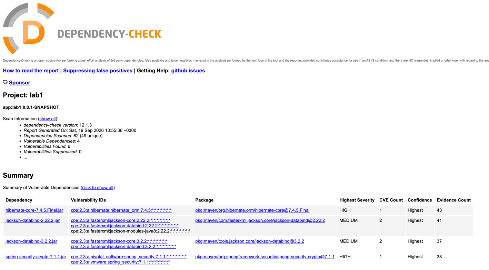
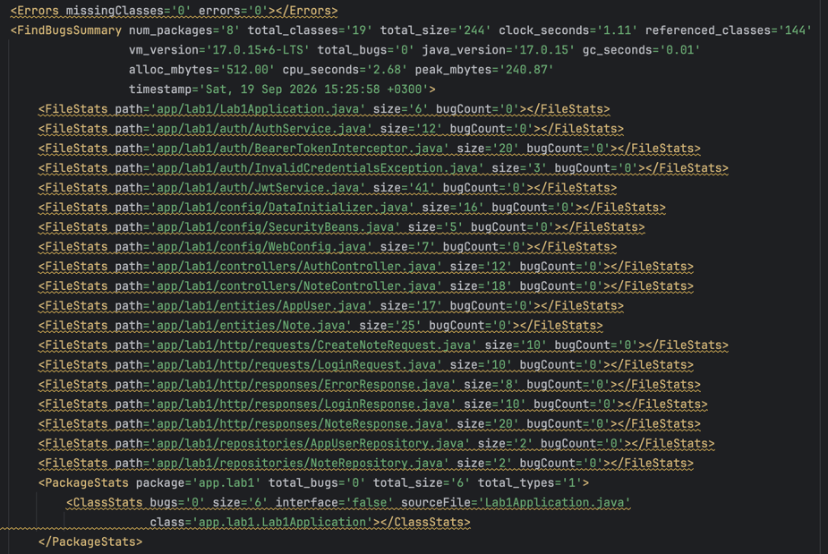

# Информационная безопасность

## Лабораторная работа №1

### Стек

- Java/Spring
- Hibernate
- PostgeSQL

### Описание API

`POST /auth/login`: метод для аутентификации пользователя (принимает логин и пароль).

```json
{
    "login": "username",
    "password": "12345678"
}
```

`GET /api/data`: метод для получения данных. Доступ только у аутентифицированных пользователей.

`POST /api/data`: метод для создания данных. Доступ только у аутентифицированных пользователей.

```json
{
  "title":"title",
  "text":"body"
}
```

### Описание реализованных мер защиты

- От **SQLi** код защищен с помощью ORM Hibernate.
- От **XSS** защищен с помощью экранирования пользовательских данных

```java
public Note(AppUser owner, String title, String text) {
    this.owner = owner;
    this.title = HtmlUtils.htmlEscape(title);
    this.text = HtmlUtils.htmlEscape(text);
    this.createdAt = Instant.now();
}
```

### Отчеты из pipeline

Dependency-check:



Spotbugs:

